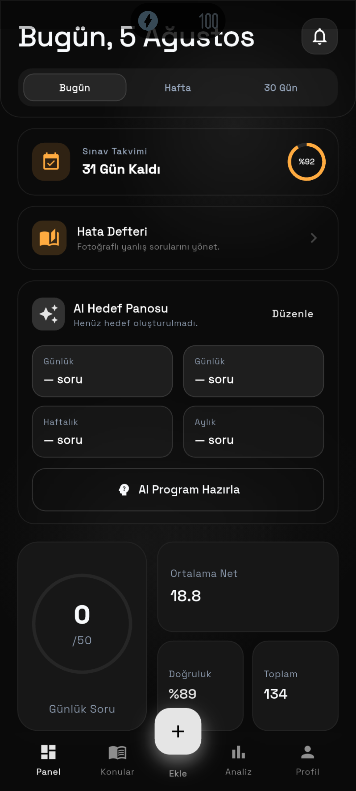
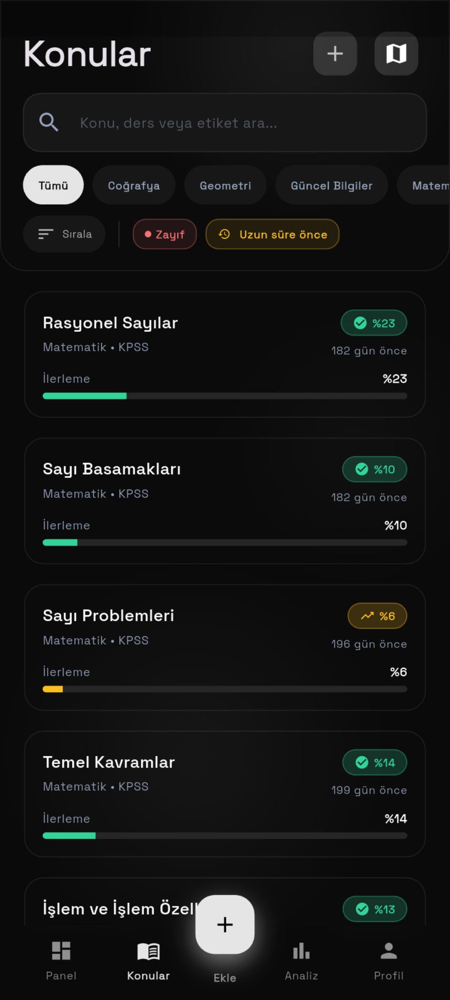

<p align="center">
  
</p>

<h1 align="center">Kıstas</h1>

<p align="center">
  
  
  
  
  
</p>

KPSS adayları için yapay zeka destekli sınav takip ve çalışma planlama uygulaması. Soru çözümlerini ders ve konu bazında kaydeder, performansını analiz eder ve hedeflerine göre çalışma önerileri sunar.

Flutter ile geliştirilmiş, Android'de çalışan, koyu temalı ve glassmorphism arayüzlü bir uygulamadır. Tüm veriler cihazda saklanır.

## Ekran Görüntüleri

<p align="center">
  
  
  
  
</p>

## Özellikler

- **Soru Takibi** — Ders ve konu bazlı soru girişi, hızlı ekleme, deneme ve net kaydı
- **Analiz** — Haftalık/aylık trend grafikleri, net ortalaması, doğruluk takibi
- **Gemini AI** — Zayıf konu analizi, hedef önerileri, haftalık bülten
- **Odak Araçları** — Pomodoro zamanlayıcı, çalışma serisi, ısı haritası, rozetler
- **Bildirimler** — Günlük hedef hatırlatıcısı, haftalık plan bildirimi
- **Tema** — 10 renk teması, koyu glassmorphism tasarım
- **Veri** — Yerel veritabanı, JSON yedekleme ve dışa aktarma

## Kullanılan Teknolojiler

| Kategori | Paket |
|---|---|
| Veritabanı | Isar |
| Yapay Zeka | Gemini API (HTTP) |
| Bildirimler | flutter_local_notifications, timezone |
| Depolama | path_provider, shared_preferences, file_picker |
| Arayüz | google_fonts, flutter_svg, flutter_animate |
| Diğer | http, share_plus, image_picker, url_launcher, package_info_plus |

## Kurulum

**Gereksinimler:** Flutter SDK 3.44+ (Dart 3.10+), Android Studio veya komut satırı araçları

```bash
# Bağımlılıkları yükle
flutter pub get

# Uygulamayı çalıştır
flutter run

# Testleri çalıştır
flutter test

# Release APK oluştur
flutter build apk --release
```

Çıktılar `build/app/outputs/` altında bulunur.

> **Gemini AI:** AI özellikleri için [Google AI Studio](https://aistudio.google.com/apikey)'dan ücretsiz API anahtarı alın ve uygulamanın **Profil** sekmesinden girin. Anahtar yalnızca cihazda saklanır, kaynak kodda yer almaz.

## Ortam Değişkenleri

Bu projede `.env` dosyası kullanılmaz. Tüm yapılandırma dosyaları (tema, API anahtarı) uygulama içi ayarlarla yönetilir; API anahtarı kullanıcı tarafından **Profil** sekmesinden girilir ve cihazda saklanır.

## Proje Yapısı

```
lib/
├── core/
│   ├── data/          # Isar veritabanı, entity'ler, konu kataloğu
│   ├── models/        # Alan modelleri
│   ├── repositories/  # Durum ve iş mantığı
│   ├── services/      # Gemini istemcisi, bildirim servisi
│   ├── theme/         # Renk paletleri, tema sistemi
│   └── widgets/       # Ortak bileşenler
└── features/
    ├── dashboard/     # Ana ekran, yol haritası, streak
    ├── questions/     # Sihirbaz, hızlı ekle, flashcard, zamanlayıcı
    ├── analysis/      # Analiz ekranı
    ├── mistakes/      # Yanlışlar galerisi ve çözüm
    └── settings/      # Profil ve ayarlar
```

## Lisans

MIT — bkz. [LICENSE](LICENSE)
