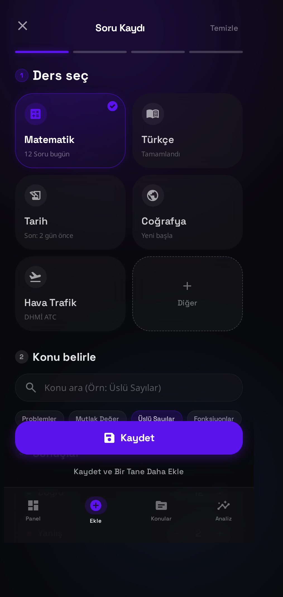

<p align="center">
  
</p>

<h1 align="center">Kıstas</h1>

<p align="center">
  KPSS P3 (ATC) adayları için yapay zeka destekli sınav takip ve çalışma planlama uygulaması.
  <br>Android için Flutter ile geliştirilmiş, koyu temalı ve glassmorphism arayüzlü.
</p>

---

## Özellikler

- **Soru Takibi** — Ders ve konu bazlı soru girişi, 4 adımlı giriş sihirbazı, hızlı ekleme, deneme ve net kaydı
- **Analiz** — Haftalık/aylık trend grafikleri, deneme kıyaslaması, net ortalaması, doğruluk takibi
- **Gemini AI** — AI mentor, performansa dayalı hedef önerileri, zayıf konu analizi, haftalık bülten
- **Odak Araçları** — Pomodoro zamanlayıcı, çalışma serisi (streak), ısı haritası, rozetler
- **Bildirimler** — Günlük hedef hatırlatıcısı, haftalık plan bildirimi, yanlış tekrar hatırlatması
- **Tema** — 10 renk teması, koyu glassmorphism tasarım, animasyonlu açılış ekranı
- **Veri** — Yerel veritabanı (Isar), JSON yedekleme ve dışa aktarma

## Ekran Görüntüleri

| Ana Ekran | Analiz | Konular |
|---|---|---|
|  |  |  |

| Hızlı Ekle | Soru/Deneme Ekle | Konu Detay |
|---|---|---|
|  |  |  |

## Kurulum

Gereksinimler: [Flutter SDK](https://docs.flutter.dev/get-started/install) (Dart 3.x)

```bash
# Bağımlılıkları yükle
flutter pub get

# Uygulamayı çalıştır
flutter run

# Testleri çalıştır
flutter test
```

## Derleme (APK)

```bash
# Debug APK
flutter build apk --debug

# Release APK
flutter build apk --release

# Play Store için AAB
flutter build appbundle --release
```

Çıktılar `build/app/outputs/` altında bulunur.

## Gemini AI

AI özellikleri için [Google AI Studio](https://aistudio.google.com/apikey)'dan ücretsiz API anahtarı alın.
Uygulamada **Profil** sekmesinden anahtarı girin ve model seçin. Anahtar yalnızca cihazda saklanır, kaynak kodda yer almaz.

## Proje Yapısı

```
lib/
├── core/
│   ├── data/          # Isar veritabanı, entity'ler, konu kataloğu
│   ├── models/        # Alan modelleri
│   ├── repositories/  # Durum ve iş mantığı
│   ├── services/      # Gemini istemcisi, bildirim servisi
│   ├── theme/         # Renk paletleri, tema sistemi
│   └── widgets/       # Ortak bileşenler
└── features/
    ├── dashboard/     # Ana ekran, yol haritası, streak
    ├── questions/     # Sihirbaz, hızlı ekle, flashcard, zamanlayıcı
    ├── analysis/      # Analiz ekranı
    ├── mistakes/      # Yanlışlar galerisi ve çözüm
    └── settings/      # Profil ve ayarlar
```

## Lisans

MIT — bkz. [LICENSE](LICENSE)
